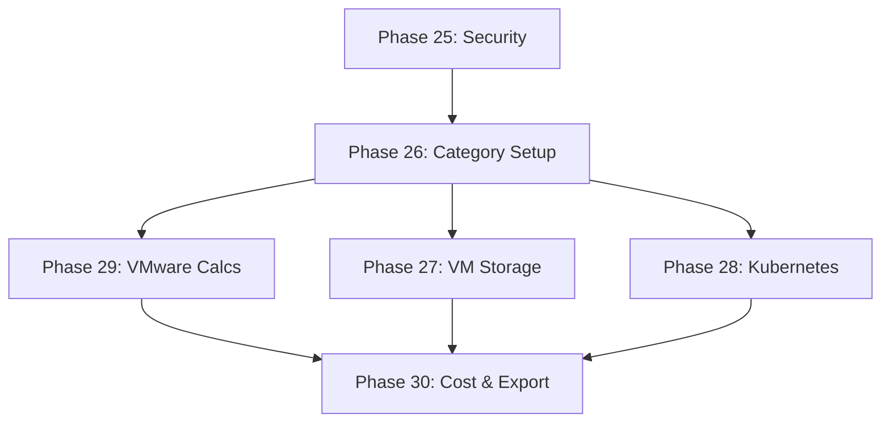

# v4.0 Roadmap - Security & Infrastructure

**Version:** 4.0
**Created:** 2026-01-25
**Status:** Active

---

## Milestone Overview

**Goal:** Eliminate security vulnerabilities and expand into enterprise infrastructure calculators.

**Scope:**

- Fix 16 CodeQL security issues (3 High, 1 Warning, 12 Note)
- Add 5 new infrastructure/virtualization calculators
- Maintain code quality and performance standards

**Estimated Duration:** 6 phases
**Target Calculators:** 172 total (167 current + 5 new)

---

## Phase 25: Security Hardening

**Goal:** Eliminate all CodeQL security vulnerabilities and code quality issues.

**Requirements:** SEC-01, SEC-02, SEC-03

**Plans:** 2 plans

Plans:

- [ ] 25-01-PLAN.md — Fix remote property injection with Map-based URL params
- [ ] 25-02-PLAN.md — Document container vulnerabilities and remove unused imports

**Deliverables:**

1. **Fix remote property injection in url-params.ts**
   - Implement parameter whitelist for URL state
   - Replace dynamic property access with safe Map-based storage
   - Test all 167 existing calculators for regression
   - Verify CodeQL scan shows 0 High severity issues

2. **Document container vulnerabilities**
   - Update `.trivyignore` with libpng CVE suppressions
   - Add documentation explaining static export (no Docker in production)
   - Set 6-month review reminder (July 2026)

3. **Clean up unused code**
   - Remove all unused imports (12 files)
   - Remove all unused variables (Warning + Note severity)
   - Verify Biome lint passes with 0 warnings
   - Update pre-commit hooks to prevent re-introduction

**Success Criteria:**

- [ ] Zero CodeQL High severity alerts
- [ ] Zero Biome warnings
- [ ] All 167 calculators work with URL state
- [ ] Security documentation updated

**Estimated Complexity:** Medium
**Dependencies:** None

---

## Phase 26: Infrastructure Category Foundation

**Goal:** Create infrastructure category and code splitting for new calculators.

**Requirements:** UX-01, UX-02

**Plans:** 2 plans

Plans:

- [x] 26-01-PLAN.md — Create infrastructure category in registry with Server icon
- [x] 26-02-PLAN.md — Add translations and create category landing page

**Deliverables:**

1. **Create infrastructure category**
   - Add "Infrastructure" to category registry
   - Design category icon
   - Add category translations (en, fr, de, it)
   - Update navigation and search

2. **Set up code splitting**
   - Add infrastructure calculator lazy loading
   - Create dynamic import structure
   - Verify initial bundle size unchanged
   - Test search performance

**Success Criteria:**

- [ ] Infrastructure category visible in UI
- [ ] Category translated in all 4 locales
- [ ] Lazy loading infrastructure ready
- [ ] No bundle size increase

**Estimated Complexity:** Low
**Dependencies:** None

---

## Phase 27: VM Storage Calculator

**Goal:** Implement vSphere ESX cluster storage capacity calculator.

**Requirements:** INFRA-01

**Deliverables:**

1. **Calculation logic**
   - Implement VM storage formulas (provisioned, swap, snapshots)
   - Support thick and thin provisioning
   - Calculate RAID overhead
   - Add input validation

2. **UI component**
   - Create vm-storage-calculator.tsx
   - Input fields: VM count, disk size, RAM, snapshot %, over-subscription %
   - Results display: Total provisioned, swap, snapshots, total required
   - Responsive design

3. **State management**
   - Create Zustand store with URL sync
   - Implement calculator store pattern
   - Test URL state persistence

4. **Translations**
   - Add translations for all 4 locales
   - Calculator title, description, inputs, results
   - Help text for complex fields

**Success Criteria:**

- [ ] Storage calculations match VMware reference tools
- [ ] URL state works correctly
- [ ] All 4 locales translated
- [ ] Responsive design verified

**Estimated Complexity:** Medium
**Dependencies:** Phase 26

---

## Phase 28: Kubernetes Capacity Calculator

**Goal:** Implement Kubernetes cluster node sizing calculator.

**Requirements:** INFRA-02

**Deliverables:**

1. **Calculation logic**
   - Implement K8s capacity formulas (CPU, memory)
   - Calculate nodes needed by constraint type
   - Apply system reserved and target utilization
   - Warning for >80% utilization

2. **UI component**
   - Create k8s-capacity-calculator.tsx
   - Input fields: Pod count, CPU/memory per pod, node specs
   - Input fields: System reserved %, target utilization %
   - Results: Nodes needed, utilization breakdown
   - Visual breakdown (CPU vs memory constraint)

3. **State management**
   - Create Zustand store with URL sync
   - Implement calculator store pattern
   - Test URL state persistence

4. **Translations**
   - Add translations for all 4 locales
   - K8s-specific terminology
   - Help text for capacity planning concepts

**Success Criteria:**

- [ ] Calculations follow K8s best practices (85-115% of average)
- [ ] Visual breakdown shows limiting factor
- [ ] URL state works correctly
- [ ] All 4 locales translated

**Estimated Complexity:** Medium
**Dependencies:** Phase 26

---

## Phase 29: VMware Server & Licensing Calculators

**Goal:** Implement server virtualization and VMware licensing calculators.

**Requirements:** INFRA-03, INFRA-04

**Deliverables:**

### Calculator 1: Server Virtualization

1. **Calculation logic**
   - Implement ESX host sizing formulas
   - Calculate by CPU and memory constraints
   - Apply vCPU-to-core ratio and utilization target
   - Add N+1 high availability option

2. **UI component**
   - Input: VM workload (count, vCPU, RAM)
   - Input: Host specs (cores, RAM)
   - Input: Constraints (ratio, utilization, HA)
   - Results: Hosts needed, consolidation ratio

3. **State & translations**
   - Zustand store with URL sync
   - All 4 locales translated

### Calculator 2: VMware Licensing

1. **Calculation logic**
   - Implement core-based licensing (16 core minimum per CPU)
   - Calculate costs for VCF ($350/core/year) and VVF ($135/core/year)
   - Calculate vSAN entitlements (1 TiB/core for VCF, 0.25 TiB for VVF)
   - Support 1/3/5 year terms

2. **UI component**
   - Input: Host config (count, CPUs, cores)
   - Input: Product type (VCF, VVF, vSphere EP, vSphere Std)
   - Input: Term years
   - Results: Total cores, annual cost, total cost, vSAN entitlement
   - Pricing disclaimer (2026 list prices)

3. **State & translations**
   - Zustand store with URL sync
   - All 4 locales translated

**Success Criteria:**

- [ ] Server calc matches VMware reference calculators
- [ ] Licensing calc uses accurate 2026 pricing
- [ ] 16-core minimum enforced
- [ ] vSAN entitlement calculated correctly
- [ ] Both calculators URL state works
- [ ] All 4 locales translated

**Estimated Complexity:** Medium
**Dependencies:** Phase 26

---

## Phase 30: Virtualization Cost Calculator & Export

**Goal:** Implement TCO calculator and add export support for all infrastructure calculators.

**Requirements:** INFRA-05, UX-03

**Deliverables:**

### Calculator: Virtualization Cost

1. **Calculation logic**
   - Implement TCO formulas (CAPEX + OPEX)
   - Calculate CAPEX (hardware costs)
   - Calculate OPEX (power, software, datacenter, labor)
   - Calculate cost per VM over term
   - Break down by category

2. **UI component**
   - Input: Hardware costs (servers, storage, network)
   - Input: Software costs (VMware, OS, backup)
   - Input: Operational (power $/kWh, cooling PUE, datacenter $/RU, labor)
   - Input: Term years
   - Results: CAPEX, OPEX annual, TCO, cost per VM
   - Visual cost breakdown chart

3. **State & translations**
   - Zustand store with URL sync
   - All 4 locales translated

### Export Support

1. **PDF export for all 5 calculators**
   - Reuse existing PDF utility from v3.0
   - Include calculator name, inputs, results
   - Support all 4 locales

2. **CSV export for all 5 calculators**
   - Reuse existing CSV utility from v3.0
   - UTF-8 BOM for Excel compatibility
   - Formula injection prevention
   - Support all 4 locales

**Success Criteria:**

- [ ] TCO calculation includes all cost categories
- [ ] Cost breakdown visual is clear
- [ ] PDF export works for all 5 calculators
- [ ] CSV export works for all 5 calculators
- [ ] Exports support all 4 locales
- [ ] All infrastructure calculators complete

**Estimated Complexity:** Medium
**Dependencies:** Phase 26

---

## Phase Dependencies

**Critical Path:** 25 → 26 → 29 → 30 (longest path)

---

## Milestone Success Criteria

**Security:**

- [ ] Zero CodeQL High/Warning/Note severity issues
- [ ] All security vulnerabilities documented or fixed
- [ ] Clean Biome lint (0 warnings)

**Functionality:**

- [ ] 5 new infrastructure calculators working
- [ ] All calculations match industry references
- [ ] URL state persistence for all calculators

**Quality:**

- [ ] 100% translation coverage (en, fr, de, it)
- [ ] Zero TypeScript errors
- [ ] PDF/CSV export for all new calculators

**Performance:**

- [ ] Infrastructure calculators lazy-loaded
- [ ] Initial bundle size unchanged from v3.0
- [ ] Search performance maintained

**Total Calculators:** 172 (167 + 5 new)

---

## Risk Management

| Risk | Phase | Mitigation |
|------|-------|------------|
| URL state fix breaks existing calculators | 25 | Comprehensive regression testing |
| VMware pricing changes mid-milestone | 29 | Add pricing disclaimer, use 2026 snapshot |
| Complex K8s calculations | 28 | Reference official K8s capacity tools |
| Translation bottleneck | All | Follow established patterns, batch translate |

---

## Notes

- All infrastructure calculators use metric units (GB, TiB, kW)
- VMware pricing uses 2026 list prices with disclaimer
- Security fixes prioritized in Phase 25 (ship early)
- Code splitting ensures performance not degraded
- Export functionality reuses v3.0 patterns

---

_Last updated: 2026-01-25_
